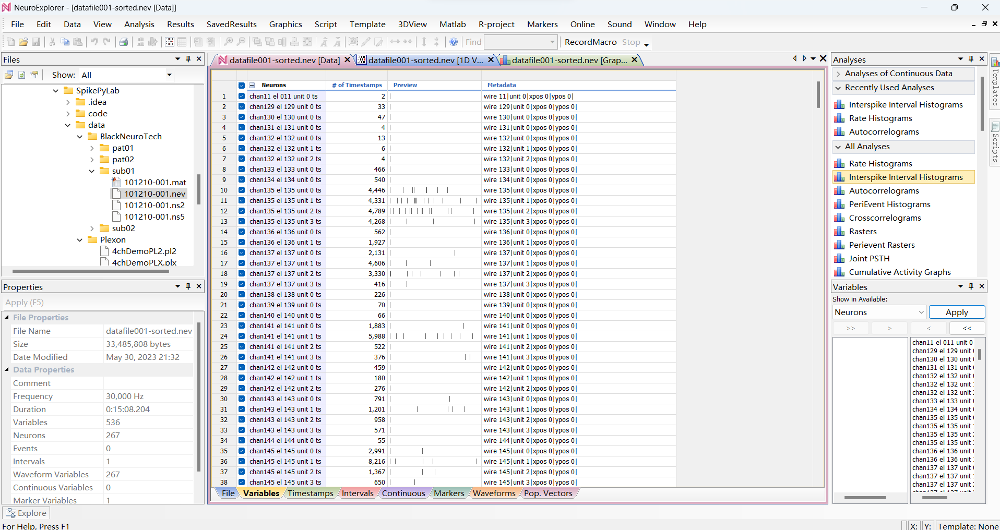
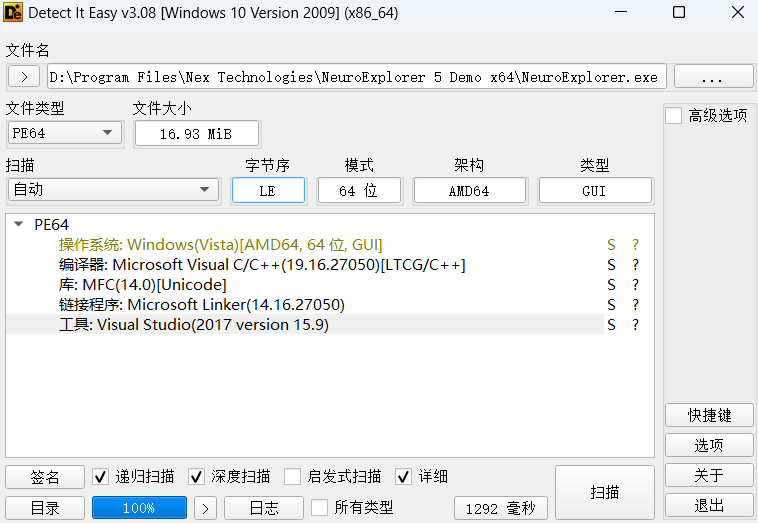

`2023-07-28 10:35:59`, neuroexplorer 确实给我带来了很多启发, 有些事情可以不需要marker即可完成, 另外, 一些 action 可以是冗余的. 如下为 neuroexplorer 的样式:

整体上, 软件布局为三栏式, 上方包含菜单栏和工具栏, 在主体布局中, 左边上侧是一个文件夹浏览器, 左侧下方是一个属性显示器, 中间展示了一个表格, 展示的是神经元的属性, 例如 Raster, Waveform 等. 这是打开文件后首次展示的结果, 下方还有许多选项卡:
File: 文件信息
Variables: 主体神经元信息
TimeStamps: 各神经元的发放时刻
Markers: 打标记的时刻对照
Waveforms: Waveform 表格
Pop.Vectors: 神经元名字(唯一)

右侧上方是一个分析栏, 下方是选择器, ...

`2023-07-28 11:12:10`, 这个软件拿什么编写的？


`2023-07-28 11:28:33`, 桌面应用程序拿什么写合适?
了解到一个开源的 PyQT项目, github链接: https://github.com/feeluown/FeelUOwn
开发者指南: https://feeluown.readthedocs.io/en/latest/

`2023-07-28 11:33:00`: 目前基本确定使用 PYQT 开发界面, 功能与样式参考 neuroexplorer


`2023-07-28 13:54:50`: 看到了一些比较好看的 PyQt5 项目:

* 15个小案例
https://github.com/pythonguis/15-minute-apps

* FeelUOwn - feel your own 音乐播放器
https://github.com/feeluown/FeelUOwn
https://feeluown.readthedocs.io/en/latest/dev_quickstart.html

* A cross-platform music player based on PyQt5.
  https://github.com/zhiyiYo/Groove

* A fluent design widgets library based on PyQt/PySide. Make Qt Great Again.
https://github.com/zhiyiYo/PyQt-Fluent-Widgets

`2023-07-28 15:12:48`: 下载和运行了 FeelUOwn 和 zhiyiYo/Groove, 看了下 Groove 的项目结构, 开发说明.

`2023-07-28 16:01:02`: 开始学习 15-minute-apps, 看了一下, 确实简单好上手, 还挺实用, 因此决定继续学习.


`2023-07-28 18:11:50`: 学习了第一个 app, browser, 这个 app 有一个菜单栏、一个工具栏、一个主窗口、一个状态栏。其中, url地址栏被作为 toolbar 的一部分, 这是添加一个 QAction 的基本步骤
```py
back_btn = QAction(QIcon(os.path.join('images', 'arrow-180.png')), "back", self)
back_btn.setStatusTip("Back to previous page")
back_btn.triggered.connect(self.browser.back)
self.navBar.addAction(back_btn)
```
也可以添加 QWidget 组件
```py
## 2. 分割线
self.navBar.addSeparator()
## 3. QLabel, 为 QLabel 设置图片
self.urlIcon = QLabel()
self.urlIcon.setPixmap(QPixmap(os.path.join('images', 'lock-nossl.png')))
self.navBar.addWidget(self.urlIcon)
```

`2023-07-28 18:25:50`: 正在学习第二个带选项卡的 browser. 学习过程中断 -- 留在明天

`2023-07-28 18:29:19`: 明天计划再学几个 app, 再使用一下布局, 以及思考项目的结构