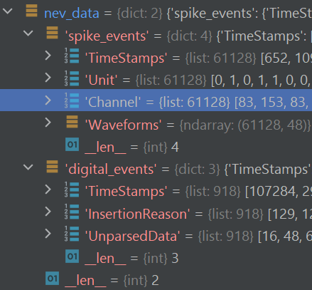

`2023-08-07 16:18:38`: 遗憾的是，没有找到官网下载数据的地址. 所以看看别的吧

`2023-08-08 12:41:40`: 这个官方示例, 似乎有很多错误, 关键在于 getdata 函数:
```py
"""
This function is used to return a set of data from the NSx datafile.
:param elec_ids: [optional] {list} User selection of elec_ids to extract specific spike waveforms (e.g., [13])
:param wave_read: [optional] {STR} 'read' or 'no_read' - whether to read waveforms or not
:return: output: {Dictionary} with one or more of the following dictionaries (all include TimeStamps)
            dig_events:            Reason, Data, [for file spec 2.2 and below, AnalogData and AnalogDataUnits]
            spike_events:          Units='nV', ChannelID, NEUEVWAV_HeaderIndices, Classification, Waveforms
            comments:              CharSet, Flag, Data, Comment
            video_sync_events:     VideoFileNum, VideoFrameNum, VideoElapsedTime_ms, VideoSourceID
            tracking_events:       ParentID, NodeID, NodeCount, PointCount, TrackingPoints
            button_trigger_events: TriggerType
            configuration_events:  ConfigChangeType, ConfigChanged

Note: For digital and neural data - TimeStamps, Classification, and Data can be lists of lists when more
than one digital type or spike event exists for a channel
"""
```

`2023-08-08 13:19:33`: 好像之前的那个下错了, 现在这一版可以看到正常的数据

`2023-08-08 13:37:21`: 感觉要把之前的工作都再做一遍了要


`2023-08-08 16:35:36`: python 读写 matlab 文件似乎不方便, 也不快捷

`2023-08-08 16:44:02`: python 也能序列化, 然而 json 似乎也是不错的选择?